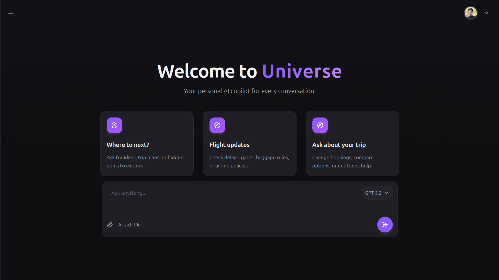
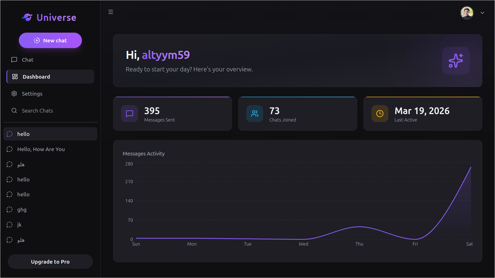
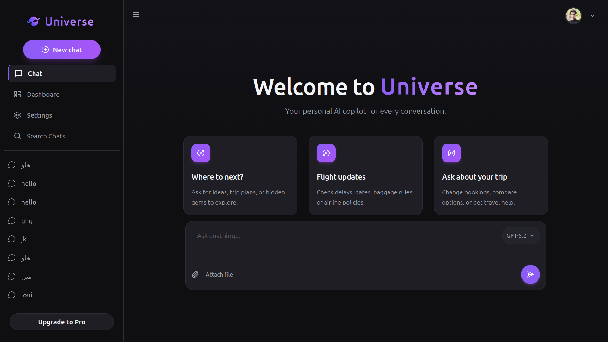
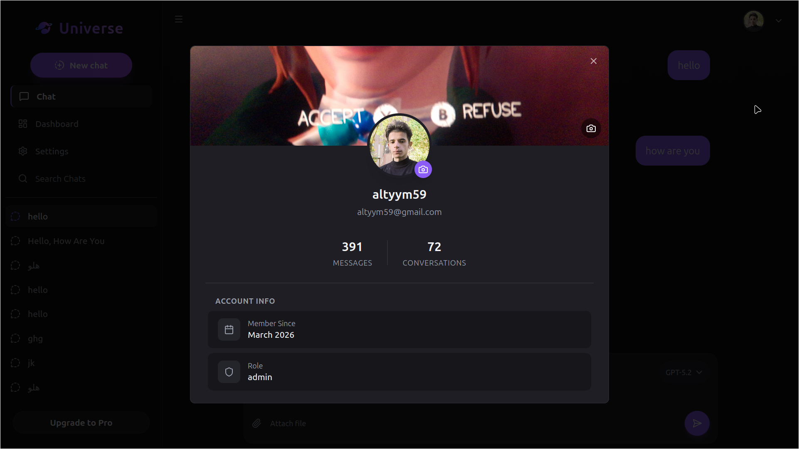
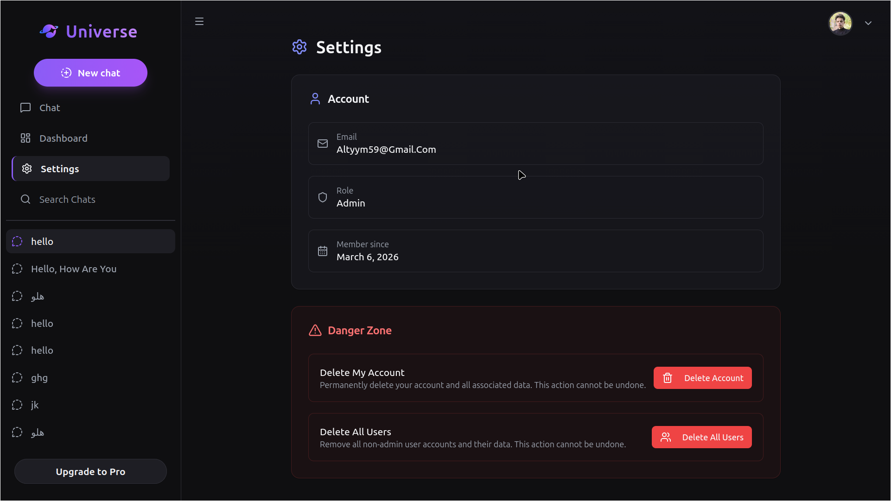
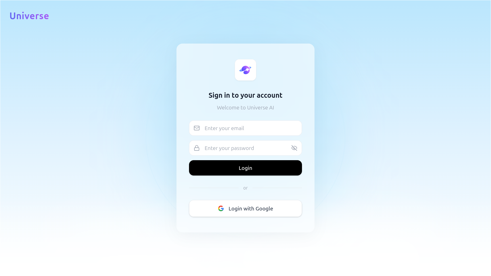

# 🤖 Full-stack AI Chatbot Dashboard

A production-ready AI chatbot dashboard built with modern web technologies.
Built with a focus on scalability, security, and real-world SaaS architecture.

This project features a secure multi-user system with role-based access control, real-time chat, and a fully responsive UI.

---

## 🚀 Features

* 🔐 Authentication (Login / Signup + Google OAuth)
* 👥 Role-based access (User / Admin)
* 🧑‍💻 Personal dashboard for each user
* 📊 Full admin dashboard with system-wide visibility
* 💬 Real-time AI Chat
* 🧠 Chat history saving (per user)
* 🔍 Advanced message search
* 🗑 Delete individual conversations
* 👤 Guest mode (use chat without creating an account)
* 👤 Profile management (avatar, cover image, personal info)
* ❌ Users can delete their own accounts
* 🗑 Admin can delete any user account
* 🔒 Data isolation: each user can only access their own data
* 🛡 Row Level Security (RLS) enforced via Supabase
* 🔐 Secure database policies to prevent unauthorized access
* ☁️ All user data (messages, profiles, chats) is securely stored per user account
* 📱 Fully responsive design (mobile, tablet, desktop)
* 🎨 Modern UI with Tailwind CSS & Radix UI
* ⚡ Fast performance using Vite
* 🧠 Custom backend functions (Supabase Edge Functions)

---

## 👤 Roles

### 👤 User

* Access personal dashboard
* View only their own data
* Chat with AI
* View and search chat history
* Edit profile (avatar, cover, personal info)
* Delete their own account

### 🛠 Admin

* Access full system dashboard
* View all users
* View all conversations
* Delete user accounts
* Manage system data

---

## 🔐 Security

* 🛡 Supabase Row Level Security (RLS) enabled
* 🔒 Strict access policies for all tables
* 👤 Users can only access their own data
* 🚫 No access to other users' data
* 🔑 Secure authentication using JWT & OAuth
* 🧠 Backend-level protection (not only frontend)

---

## 🧠 Architecture Highlights

* Multi-user system with strict data isolation
* Role-based authorization (User / Admin)
* Secure backend using Supabase RLS policies
* Scalable frontend architecture with reusable components

---

## 🛠 Tech Stack

* ⚛️ React + TypeScript
* ⚡ Vite
* 🎨 Tailwind CSS
* 🧩 Radix UI
* ☁️ Supabase (Auth + Database + RLS)

---

## 📸 Screenshots

### 🧑‍💻 Interface

 

### 🧑‍💻 Dashboard



### 💬 Chat



### 👤 Profile



### ⚙️ Settings



### 🔐 Login / OAuth



---

## ⚙️ Installation

```bash
git clone https://github.com/kimtsuny/ai-chat-dashboard
cd ai-chat-dashboard
npm install
npm run dev
```

---

## 🔑 Environment Variables

Create a `.env` file in the root and add:

```env
VITE_SUPABASE_URL=your_url
VITE_SUPABASE_KEY=your_key
```

---

## 🌐 Live Demo

🚀 **Live Demo:** https://universe-ai-dashboard.vercel.app/

---

## 📌 Project Purpose

This project demonstrates building a real-world SaaS-style dashboard with secure multi-user architecture, role-based access, and modern UI/UX.
It was developed as part of my journey toward becoming a freelance full-stack developer.

---

## 📫 Contact

* GitHub: https://github.com/kimtsuny
* Email: [altyym59@gmail.com](mailto:altyym59@gmail.com)

---

⭐ If you like this project, feel free to star the repository!
